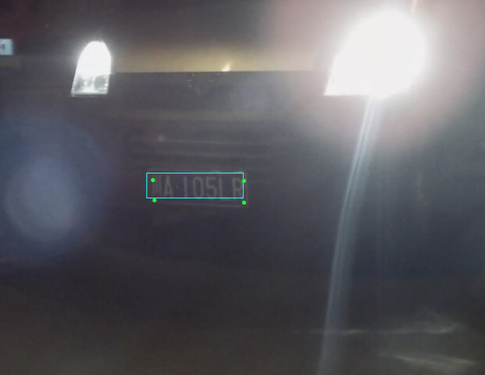
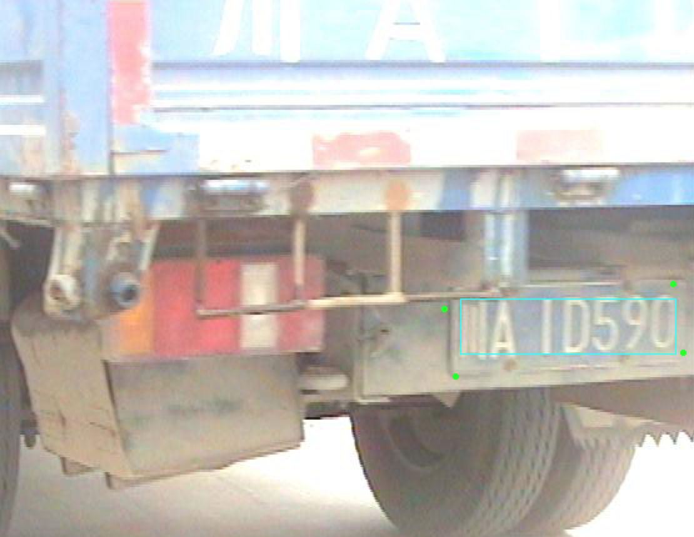
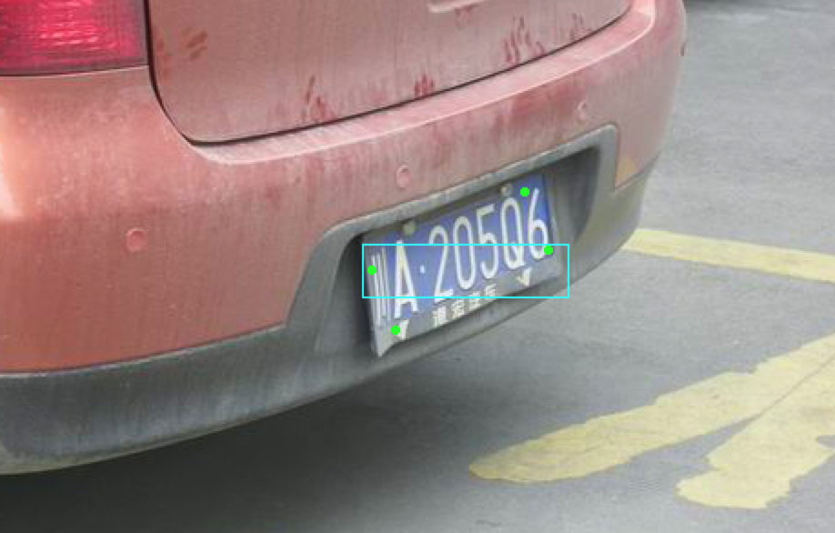
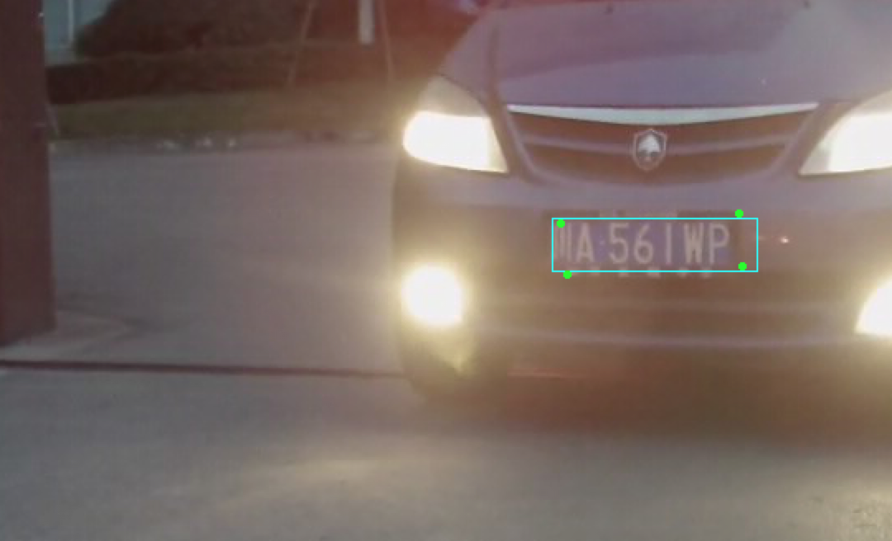
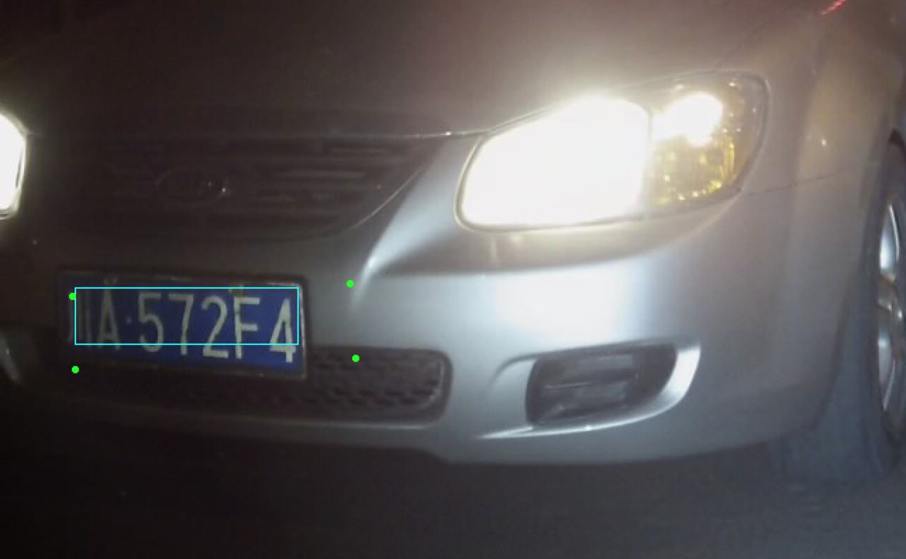
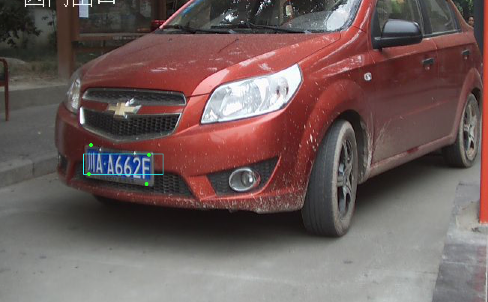
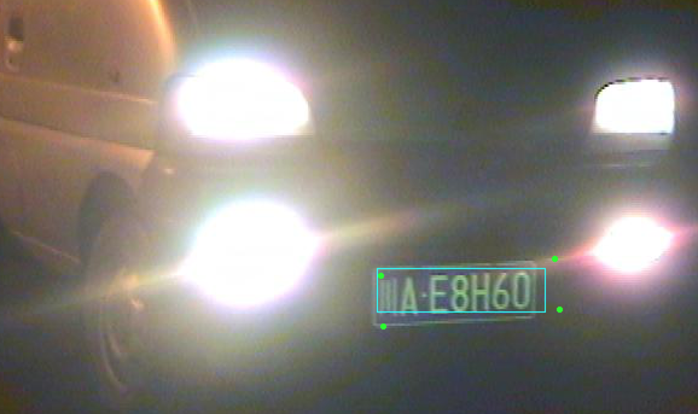
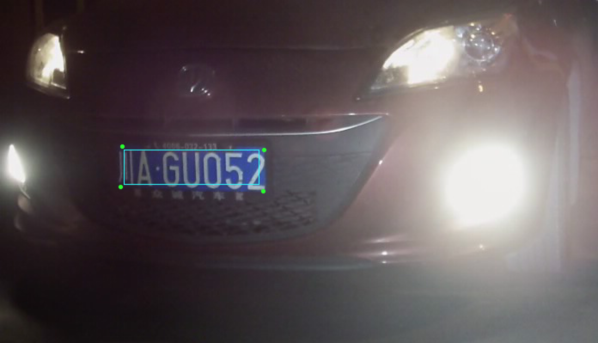
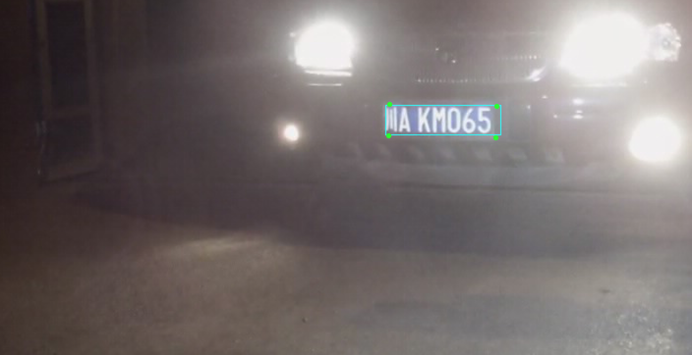

### Rubost Chinese License Plate Locate Using LBP+adaboost with CNN regression

#### Result:

### Dependency

- Opencv
- Keras(theano-backend  " tf data order")
- Numpy

### Anthor

- Jack Yu
